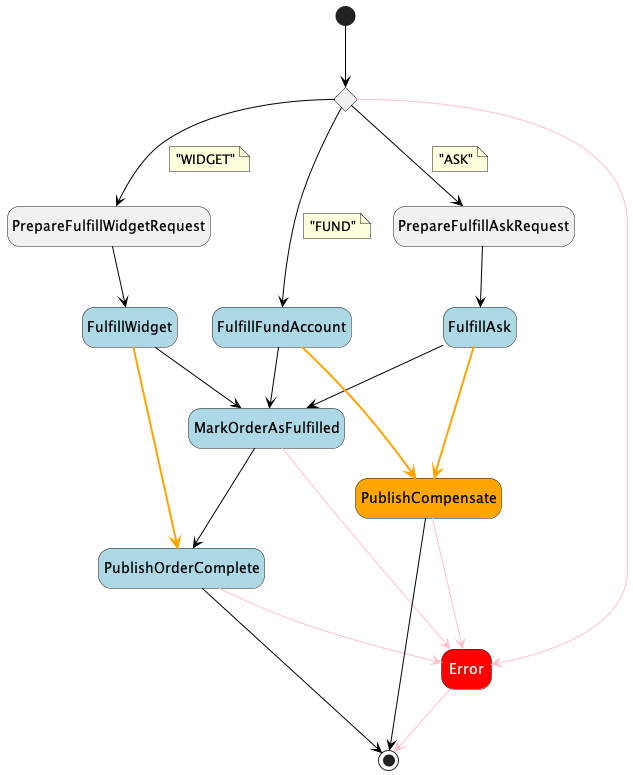
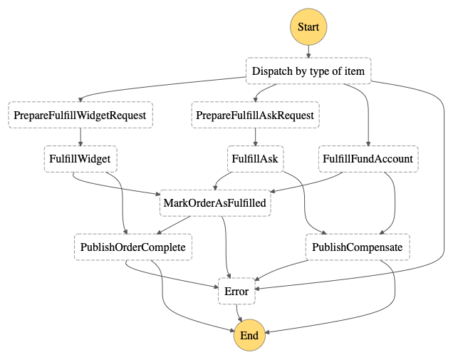
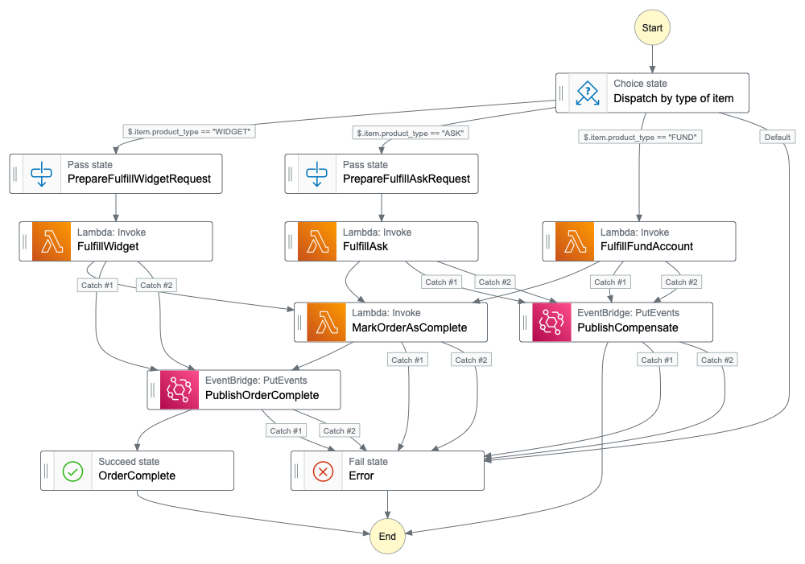

# asl-puml

[](https://github.com/massfords/asl-puml/blob/master/LICENSE)
[](https://badge.fury.io/js/asl-puml)

[](https://www.npmjs.com/package/asl-puml)

## What does it do?

Generates a plantuml state diagram from a valid [**Amazon States Language**](https://states-language.net/spec.html) file. 

## Example rendering from this plugin



## Example rendering from AWS Console / AWS Toolkit



A rendering of the step function that matches the rendering from the AWS Development Console is available
for some IDE's but not all. I've seen support for it in [AWS Toolkit for VS Code](https://aws.amazon.com/visualstudiocode/)
but not in [AWS Toolkit for Webstorm](https://aws.amazon.com/webstorm/). 

## Example rendering from AWS Workflow Studio



## Install
```bash
# Use via the CLI
npm install -g asl-puml
# Use in your code
npm install asl-puml
```

## CLI
```bash
$ asl-puml --help

  Usage: asl-puml [options]

  Amazon States Language to PUML

  Options:

    -v, --version                       output the version number
    --json-definition <jsonDefinition>  JSON definition
    --json-path <jsonPath>              JSON path
    --silent                            silent mode
    -h, --help                          output usage information
```
Return status:
- `0` if diagram was generated
- `1` if there was an error

## In your code
```javascript
const aslPuml = require('asl-puml');
const definition = require('./path/to/my/state/machine/json/definition');
const { isValid, puml, message } = aslPuml(definition);
if (isValid) {
  console.log(puml)
} else {
  console.error(message);
}
```

## Test
```bash
npm run test
```

## Lint
```bash
npm run lint
```

## See also
- [ASL specifications](https://states-language.net/spec.html)
- [ASL documentation on AWS website](http://docs.aws.amazon.com/step-functions/latest/dg/concepts-amazon-states-language.html)
- [PlantUML state diagram documentation](https://plantuml.com/state-diagram)

## License
See [LICENSE](./LICENSE).
