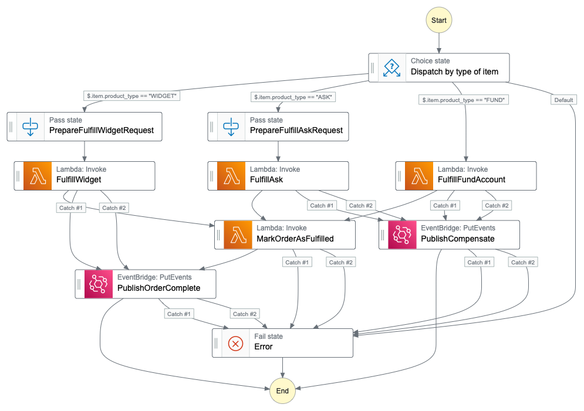

# asl-puml

[](https://github.com/massfords/asl-puml/blob/master/LICENSE)
[](https://badge.fury.io/js/asl-puml)

[](https://www.npmjs.com/package/asl-puml)

## What does it do?

Generates a plantuml state diagram from a valid [**Amazon States Language**](https://states-language.net/spec.html) file.

## But why? There's already good tooling from AWS.

The existing tools are good but I'm looking for a simpler rendering that encodes a little more info than the AWS Toolkit. 

I also do all of my development in an IDE and don't want to switch to the browser based AWS Workflow Studio. 

## Example step function

See `__tests__/Definitions/demo.asl.json` for the step function used for these examples.

The diagrams below show the same step function rendered by:
- asl-puml (this library)
- AWS Toolkit
- AWS Workflow Studio

## Feature comparison 

| <br/><br/><br/>Feature or Style                                       | asl-puml                                                                                                         | AWS Toolkit                                                                                                                      | AWS Workflow Studio                                                                                       |
|-----------------------------------------------------------------------|------------------------------------------------------------------------------------------------------------------|----------------------------------------------------------------------------------------------------------------------------------|-----------------------------------------------------------------------------------------------------------|
| renders the step function as a state diagram                          |  |  |  |
| diagram matches the style seen in AWS Console for instance executions | no                                                                                                               | yes                                                                                                                              | no                                                                                                        |
| renders the step function within Webstorm or other JetBrains products | yes, via the existing plantuml plugin                                                                            | no, not in [AWS Toolkit for Webstorm](https://aws.amazon.com/webstorm/)                                                          | no                                                                                                        |
| renders the step function within VS Code                              | yes, via the existing plantuml plugin                                                                            | yes, available in [AWS Toolkit for VS Code](https://aws.amazon.com/visualstudiocode/)                                            | no                                                                                                        |
| conveys the behavior for the state                                    | yes, via colors and some icons                                                                                   | no                                                                                                                               | yes, very familiar AWS icons and colors.                                                                  |
| avoid drawing duplicate paths to reduce clutter (catches)             | yes                                                                                                              | yes                                                                                                                              | no, all paths are drawn                                                                                   |
| identify the compensate path                                          | yes, albeit hard coded by state name regex                                                                       | no                                                                                                                               | no                                                                                                        |
| label the state transition if conditional                             | yes, limited support with StringEquals                                                                           | no                                                                                                                               | yes, expression is shown in a note on the line                                                            |
| label the path from a catch                                           | yes, with line weight and color                                                                                  | no                                                                                                                               | path is labeled with a Catch                                                                              |
| label the path to a Fail state                                        | yes, with line weight and color                                                                                  | no                                                                                                                               | no                                                                                                        |


A rendering of the step function that matches the rendering from the AWS Development Console is available
for some IDE's but not all. I've seen support for it in 
but not in . 

## Install
```bash
# Use via the CLI
npm install -g asl-puml
# Use in your code
npm install asl-puml
```

## CLI
```bash
$ asl-puml --help

  Usage: asl-puml [options]

  Amazon States Language to PUML

  Options:

    -v, --version                       output the version number
    --json-definition <jsonDefinition>  JSON definition
    --json-path <jsonPath>              JSON path
    --silent                            silent mode
    -h, --help                          output usage information
```
Return status:
- `0` if diagram was generated
- `1` if there was an error

## In your code
```javascript
const aslPuml = require('asl-puml');
const definition = require('./path/to/my/state/machine/json/definition');
const { isValid, puml, message } = aslPuml(definition);
if (isValid) {
  console.log(puml)
} else {
  console.error(message);
}
```

## Test
```bash
npm run test
```

## Lint
```bash
npm run lint
```

## See also
- [ASL specifications](https://states-language.net/spec.html)
- [ASL documentation on AWS website](http://docs.aws.amazon.com/step-functions/latest/dg/concepts-amazon-states-language.html)
- [PlantUML state diagram documentation](https://plantuml.com/state-diagram)

## License
See [LICENSE](./LICENSE).
